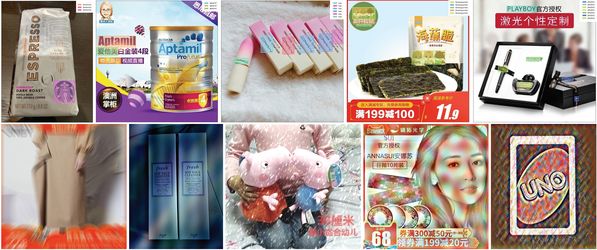

# Robust Logo Detection in E-Commerce Images by Data Augmentation (MM 2021)

This is the code of our solution for the [ACM MM2021 Robust Logo Detection Grand Challenge](https://s.alibaba.com/challenge/ACMMM2021ChallengeRobustLogoDetection/). 
The competition is hold on [TIANCHI platform](https://tianchi.aliyun.com/competition/entrance/531888/introduction) and requires the detection of logos (515 categories) in e-commerce images. 
It is challenged by long-tail distribution, small objects, and different types of noises. To overcome these challenges, we built a highly optimized and robust detector. More detailed can be found in our [paper](https://dl.acm.org/doi/abs/10.1145/3474085.3479227?casa_token=6yqQQw5Oj1gAAAAA:OGGaM7lwVk3ZplppxnZFzHtoDdyb-blNdfVCkAOriq5simpVJ6rNy-LyYSy9542Kh4HkKqFBud90). 
We ranked 5/36489 in the competition.

<p align="center">

</p>

## Requirements

Our code is based on [mmdetection](https://github.com/open-mmlab/mmdetection) code base. [Here](docs/get_started.md) is a document for installation.

The dataset should be organized as follows for training and testing:

```
- data
  - tianchi 
    - openbrand_train.json
    - train
      - xxx.jpg 
      ...
    - testA_imgList.json
    - val
      - xxx.jpg
      ...
    - testB_imgList.json
    - testB
      - xxx.jpg
      ...
```


## Configs

Our configure files for the preliminary and final round are shown below.

| Round       | Config      | AP_test  |
|  ---        |  ---        | ---      |
| preliminary |   [preliminary_round.py](sample_test/preliminary_round.py) |  64.64* |
| final |   [final_round.py](sample_test/final_round.py) |  61.26 |

*: trained 20 epochs due to time constraints.


## Offline Data augmentation

Some data augmentations used in the final round model are quite slow, and we adopt an offline implementation.
They are calculated by the following scripts in advance and randomly replace the original images during training.

* [Zoom/Glass blur](scripts/corrupt_dataset.py)
* [Style transfer](scripts/stylize_dataset.py)*

*: In order not to violate the rules, we adopt an optimization-based implementation. The style images are sampled from the training set.


## Citation

If you find this project useful in your research, please consider citing:

```bibtex
@inproceedings{chen2021robust,
  title={Robust Logo Detection in E-Commerce Images by Data Augmentation},
  author={Chen, Hang and Li, Xiao and Wang, Zefan and Hu, Xiaolin},
  booktitle={Proceedings of the 29th ACM International Conference on Multimedia},
  pages={4789--4793},
  year={2021}
}
```